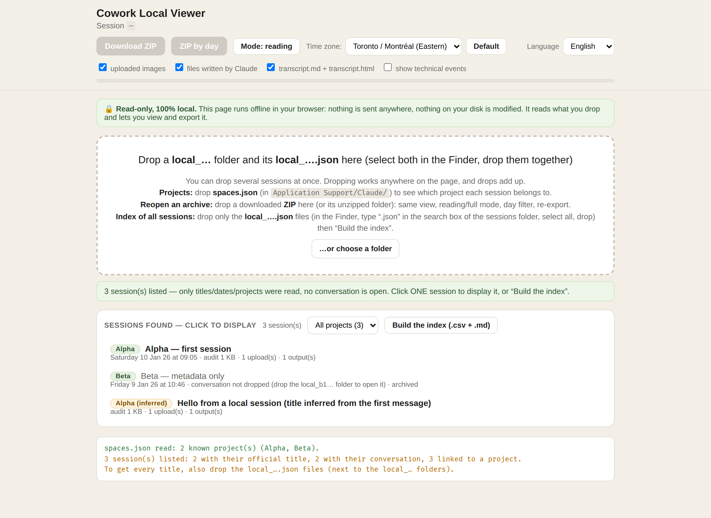
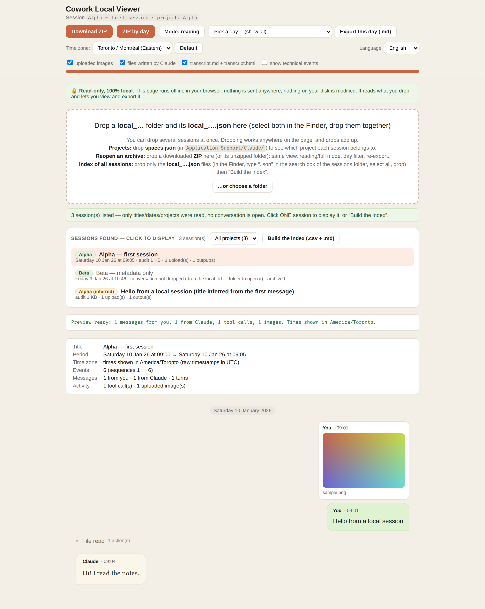

# Cowork Local Viewer

<!-- authors: 7hud41 · license: MIT -->

A read-only, offline page that archives the **local Cowork sessions** stored by the Claude desktop app. Drop a session folder on the page: it rebuilds the conversation tree from the raw audit log, links each session to its **project**, shows the same chat-style preview as the browser extension, and exports a complete ZIP. It also builds an **index of every session** (id ↔ title ↔ project ↔ dates) and reopens archives you exported earlier.

Companion projects:

- [archive-cowork-conv-claude-web](https://github.com/7hUd41/archive-cowork-conv-claude-web) — the Chrome extension for cloud sessions (`claude.ai/cowork/cse_…`); its engine is vendored here in `engine/`.
- [archive-cowork-conv-claude-export-viewer](https://github.com/7hUd41/archive-cowork-conv-claude-export-viewer) — a lighter page that only reopens exported ZIPs.

## Screenshots

Sessions dropped on the page, with their project chip (green: declared in `local_….json`; amber: inferred from the audit log), a metadata-only session, the project filter and the index button:



A session opened: time zone selector, summary, then the conversation with the image re-attached from `uploads/`:



(All screenshots use the synthetic fixtures from `tests/`, not a real conversation.)

## Where local sessions live

On macOS the Claude desktop app keeps them under
`~/Library/Application Support/Claude/local-agent-mode-sessions/<user-id>/<workspace-id>/`:

```
local_<uuid>.json        title, dates, model, selected folders         ← one small file per session
local_<uuid>/            the session itself
├── audit.jsonl          every event, one JSON per line (user / assistant / system / result)
├── uploads/             files and images you sent
└── outputs/             files the session produced
```

Projects are described in `~/Library/Application Support/Claude/spaces.json` (name, id, folders). The page never lists your disk: it only reads what you drop on it.

## Run

```
node server.js
```

This serves `index.html` on `http://127.0.0.1:4747` and opens it. The server does nothing else (no API, no disk listing). It is needed because Chrome refuses to read a **folder** dropped on a page opened as `file://`; served from localhost, drag-and-drop works. Dropping ZIP files works either way.

Then, in the Finder, select a `local_…` folder **and** its `local_….json`, and drop both on the page. Drops add up, in any order.

## What the page does

- **Sessions**: one row per dropped session, with its official title (from `local_….json`) or, failing that, the beginning of your first message. Click a row to display the conversation; nothing is parsed before you click.
- **Projects**: drop `spaces.json` once and each session gets a project chip. The link uses the folder declared in `local_….json`; when that is missing, the project folder path is searched in the audit log (chip marked *inferred*). A project filter and a title search narrow the list.
- **Index**: drop only the `local_….json` files (in the Finder, type `.json` in the search box of the sessions folder, select all, drop) then **Build the index**: you get a `.csv` (semicolon separated, opens in Numbers/Excel) and a `.md` grouped by project, with id, title, dates (UTC and local), size, and whether the conversation was dropped.
- **Time zone**: files only keep UTC instants, not where you were. Pick the time zone per session (default `America/Toronto`); the choice is remembered and written into the exports. **Default** applies the current choice to every session without a remembered one.
- **Export**: **Download ZIP** gives the same structure as the extension (`events.json`, `images/`, `written-files/`, `transcript.md`, `transcript.html`, `manifest.json`) plus the local extras: `audit.jsonl`, `uploads/`, `outputs/`, `session-meta.json` and `session-local.json` (project, time zone). **ZIP by day** and **Export this day (.md)** work as in the extension.
- **Reopen an archive**: drop a ZIP (or its unzipped folder) exported by this page or by the extension: same view, reading/full mode, day filter, re-export. The project and the time zone chosen at export time are restored.
- **Language**: English by default, French available; the choice is remembered and exports follow it.

If a file changed on disk after you dropped it (session still open in Cowork, cloud sync…), Chrome invalidates its reference. Attachments are therefore read as soon as a session is opened; anything still unreadable at ZIP time is listed in `UNREADABLE-FILES.txt` and the ZIP is built without it.

## Build

`index.html` is generated, fully self-contained (fonts, JSZip, engine and loader inlined, ~2.7 MB):

```
python3 build.py                 # index.html, full local viewer
python3 build.py --mode archive  # archive reader only (what the export-viewer project ships)
```

Sources: `src/loader.js` (drop handling, audit.jsonl adapter, projects, index, archives, time zones) and `engine/` (`archive.js`, `viewer.css`, `viewer.js`, `i18n.js`, fonts, JSZip — copied from the extension project). Tests are end-to-end (Playwright, headless Chromium) with synthetic fixtures: see `tests/README.md`.

## License

MIT — see `LICENSE`. Fonts under the SIL Open Font License, JSZip under MIT.
